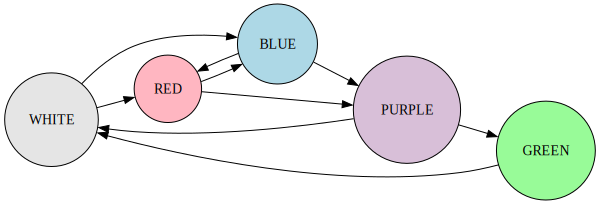

# snail

> Slow Notes Around Immediate Location

Snail is a _work-in-progress_ relayed protocol for unsupervised sneakernet devices.
This repository contains a full node implemenation that uses Wifi NAN for promiscuous communication
as a means to research, iterate and simplify.

## What you need
For now,  
An ESP32 attached to battery, and an SDCard for storage.

Optional addons:
 - Button
 - RGB-Led
 - OLED (SH1107)

<!--
## Releases

> Don't ask, just flash!

[M5 Atom Lite]() [Firmware]()
[M5 Stack]() [Firmware]()
[Wemos + SH1106LCD]() [Firmware]()
-->

## Flashing instructions

1. Install esp-idf
2. `idf.py build`
3. `idf.py flash`

## Architecture

[Sneakernet](https://en.wikipedia.org/wiki/Sneakernet) is the art of transfering data by moving it in physical space without relying on the internet.
The protocol relies on eventual message delivery within geographical bounds.

A snail node is fully autonomous and transitions between the following 5 states:

- `WHITE` wakeup state, cleanup previous peer connections and re-init radios if necessary
- `RED` Searching for beacons, initiate connections to peers.
- `BLUE` Broadcast beacons, accept peer connections.
- `PURPLE` Peer found, establish direct connection.
- `GREEN` Exchanging messages.

**Complete Table of Transitions**

| Current | Action        | Next   |
|---------|---------------|--------|
| WHITE   | roll_0        | BLUE   |
| WHITE   | roll_1        | RED    |
| BLUE    | timeout       | RED    |
| RED     | timeout       | BLUE   |
| RED     | ping_sent     | PURPLE |
| BLUE    | ping_recv     | PURPLE |
| PURPLE  | connected     | GREEN  |
| PURPLE  | timeout       | WHITE  |
| GREEN   | timeout       | WHITE  |
| GREEN   | reconciliated | WHITE  |

## References
- It's all connected.

<!--
- [That Wifi NAN Paper]()
- [Wifi Aware (NAN) Specifications 3.1]()
- [Range Based Set Reconcilliation]() impl. [Negentropy]()
-->

## License

2024 © Tony Ivanov - AGPLv3 / Creative Commons Share Alike
